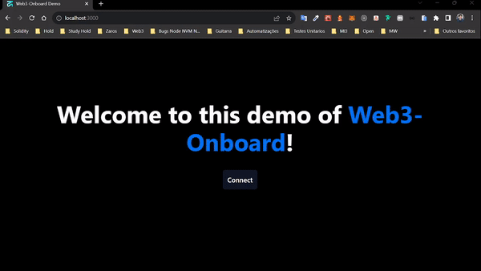

# Example blocknative wallet connect

> Wallet connect example

<a href="https://github.com/0xjoaovpsantos">

</a>

<a href="#">

</a>

<a href="https://github.com/0xjoaovpsantos/example-blocknative-wallet-connect/stargazers">

</a>

<a href="https://github.com/0xjoaovpsantos/example-blocknative-wallet-connect/network/members">

</a>

<a href="#">

</a>

<a href="https://github.com/0xjoaovpsantos/example-blocknative-wallet-connect/commits/master">

</a>

<br/><br/>

<p align="center">
  
</p>

<blockquote align="center">
  This project is open-source, you can also contribute: D
</blockquote>

<hr/>

## 💡 About the project:

Link to test: https://example-blocknative-wallet-connect.vercel.app/

Study about wallet connect using the web3 onboard blocknative

## 🔥 Techs:

- NextJS
- TypeScript

# :construction_worker: Installation

**You need to install [Node.js](https://nodejs.org/en/download/) and [Yarn](https://yarnpkg.com/)**

`git clone https://github.com/0xjoaovpsantos/example-blocknative-wallet-connect.git`

SSH URLs provide access to a Git repository via SSH, a secure protocol. If you have a SSH key registered in your Github account, clone the project using this command:

`git clone git@github.com:0xjoaovpsantos/example-blocknative-wallet-connect.git`

**Install dependencies**

`yarn install`


# :runner: Getting Started

```
yarn dev
```

<br/>

<h4 align="center">
  Let's share knowledge and grow together!!!
</h4>

<br/>

---

<h3 align="center">
Author: <a alt="João Victor Pereira Santos" href="https://github.com/0xjoaovpsantos">João Victor Pereira Santos</a>
</h3>

<p align="center">

  <a alt="João Victor Pereira Santos Linkedin" href="https://www.linkedin.com/in/joao-victor-pereira-santos//">
    </a>
  <a alt="João Victor Pereira Santos GitHub" href="https://github.com/0xjoaovpsantos">
  </a>
 <a alt="João Victor Pereira Santos Twitter" href="https://twitter.com/0xjoaovpsantos">
  </a>

</p>
